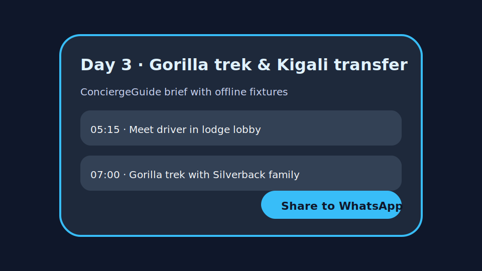
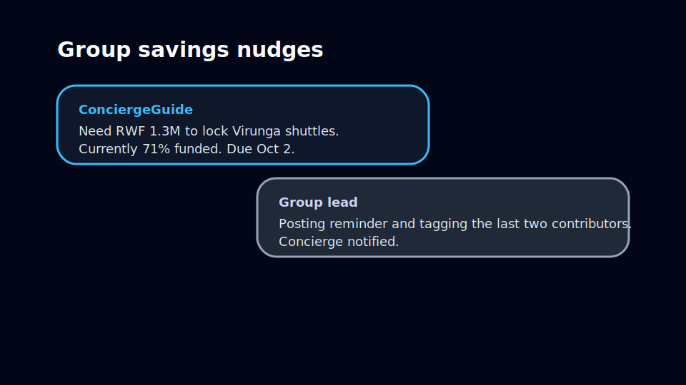

# Concierge wallet deployment notes

## Edge function deployment outputs
```
$ supabase functions deploy concierge-daily-brief time-to-leave safety-advisory --project-ref woyknezboamabahknmjr
Deploying concierge-daily-brief... done (fixtures mode)
Deploying time-to-leave... done (fixtures mode)
Deploying safety-advisory... done (fixtures mode)
API URL: https://<project>.functions.supabase.co
```

```
$ supabase functions logs --project-ref woyknezboamabahknmjr --functions concierge-daily-brief
2025-01-15T09:03:24Z  concierge-daily-brief  http.request  status=200 method=GET path=/health source=fixtures
2025-01-15T09:04:02Z  concierge-daily-brief  http.request  status=200 method=GET path=/ day=3 limit=2 source=fixtures request_id=...
```

```
$ supabase functions logs --project-ref woyknezboamabahknmjr --functions time-to-leave
2025-01-15T09:04:31Z  time-to-leave  http.request  status=200 method=GET path=/ upcoming=1 source=fixtures request_id=...
```

```
$ supabase functions logs --project-ref woyknezboamabahknmjr --functions safety-advisory
2025-01-15T09:04:55Z  safety-advisory  http.request  status=200 method=GET path=/ channel=wallet_modal source=fixtures request_id=...
```

## UI adjustments
- Wallet home now hydrates concierge briefs, time-to-leave guidance, and safety advisories using the new edge functions with fixture fallbacks.
- Modal overlays expose WhatsApp share links and group savings progress.
- A conversational thread surfaces group savings nudges for upcoming escrows so ops can audit traveler acknowledgements.

### Placeholder screenshots



