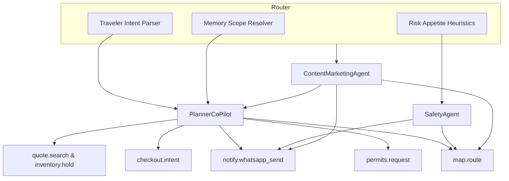
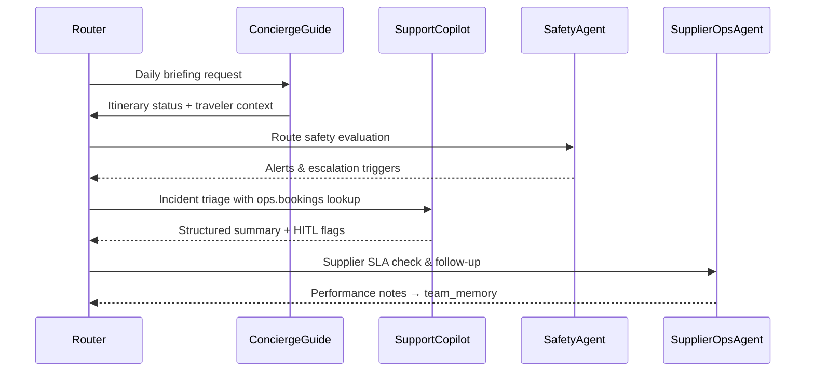
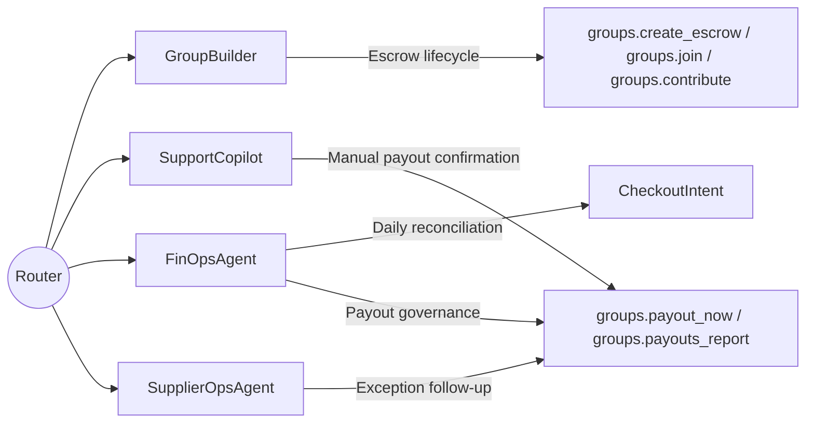

# Router-Agent Interaction Diagrams

These diagrams summarize how the ecoTrips router delegates domain work to the specialist agents defined in `agents/agent_registry.yaml`. Use them as orientation aids when wiring orchestration logic or reviewing fallback paths.

## Trip Planning & Storytelling

- **PlannerCoPilot** owns itinerary synthesis, price integrity, and memory updates across `short_term`, `working_plan`, and `long_term` scopes while invoking bundled quote/search tooling.
- **SafetyAgent** evaluates daylight and advisory heuristics, intercepting risky legs before the traveler sees them, and relays urgent updates via WhatsApp.
- **ContentMarketingAgent** repackages confirmed itinerary data into shareable cards or SEO-friendly snippets and cross-checks availability against the Planner outputs.

## In-Trip & Support Operations

- **ConciergeGuide** keeps travelers on schedule by combining `map.route`, `map.nearby`, and WhatsApp nudges with itinerary context.
- **SupportCopilot** manages post-booking incidents, coordinating refunds, rebookings, or payouts with strict human-in-the-loop guardrails.
- **SupplierOpsAgent** monitors supplier confirmations, retries safe automations, and feeds team-wide learnings into `team_memory` scopes.
- **SafetyAgent** continues to monitor live travel segments and warns both Concierge and Support about emergent risks.

## Group Savings & Finance Safeguards

- **GroupBuilder** handles social savings campaigns, ensuring transparent contribution progress and highlighting refund policies inside every summary.
- **FinOpsAgent** reconciles payments, supervises refunds, and enforces dual control across Stripe webhooks and payout flows.
- **SupportCopilot** authorizes payout or refund exceptions only after human review, coordinating with Finance for ledger accuracy.
- **SupplierOpsAgent** keeps supplier-driven payouts or adjustments aligned with confirmation SLAs and escalation policies.

> **Note:** When onboarding new agents, extend these diagrams to illustrate how additional memory scopes, guardrails, and tool bundles fit into the router’s delegation model.
