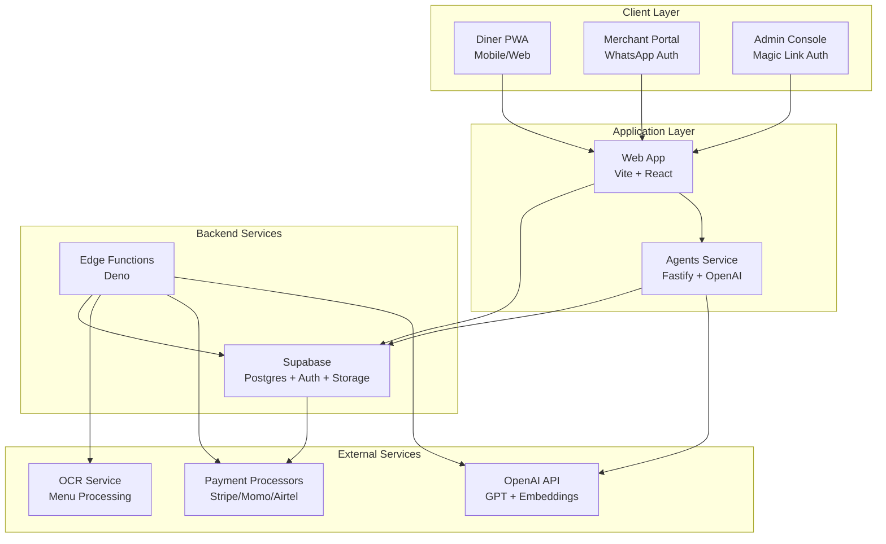
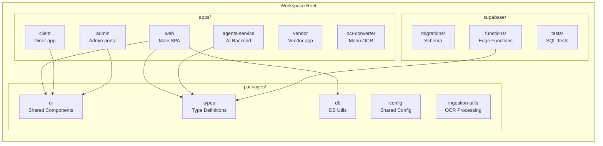
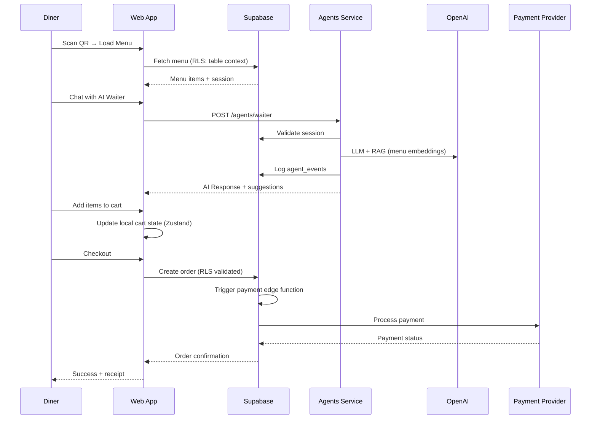
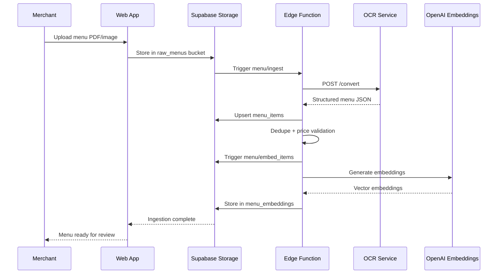
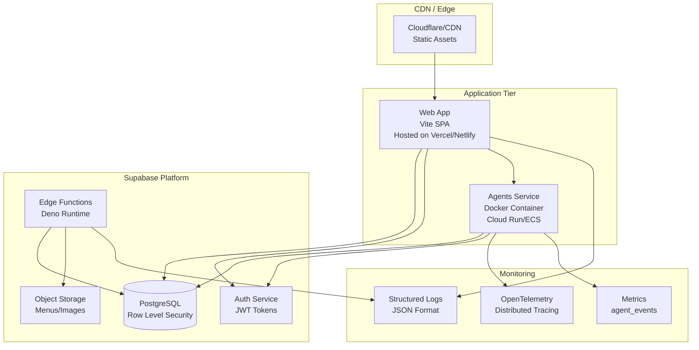
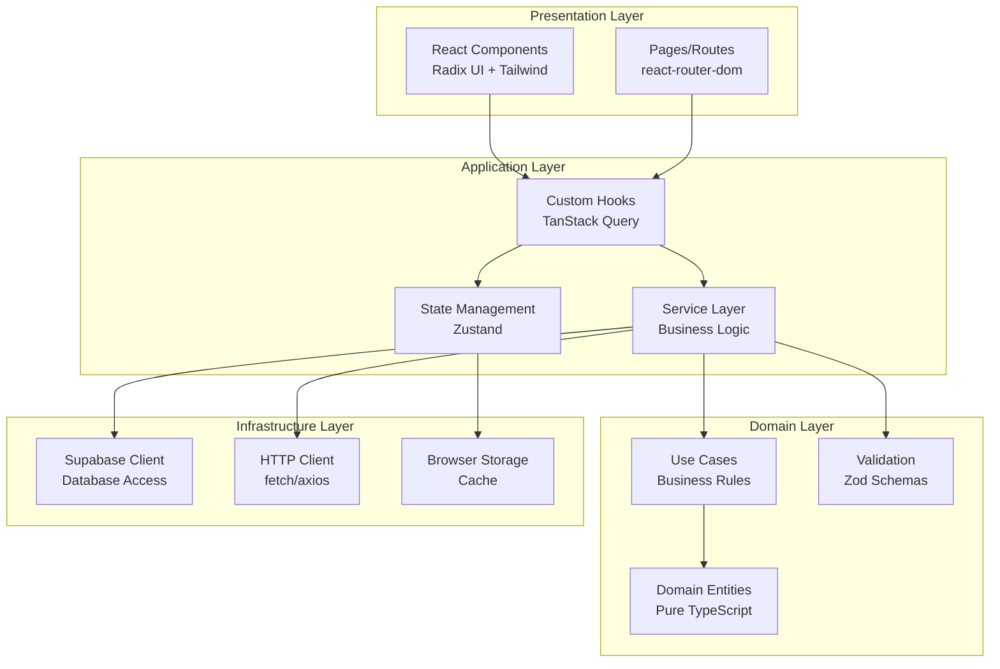
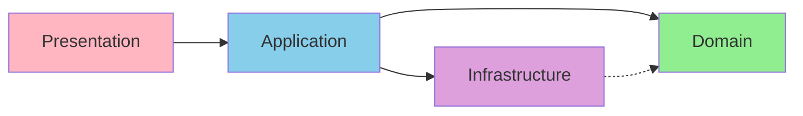
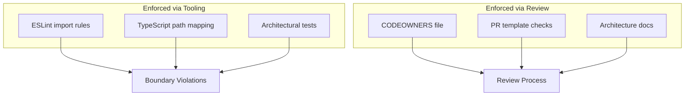

# ICUPA Architecture Overview

This document describes the architecture of the ICUPA multi-tenant PWA platform for in-venue ordering. It is a living reference – update it when you introduce new services, flows, or deployment targets.

## Table of Contents

- [System Overview](#system-overview)
- [High-Level Architecture](#high-level-architecture)
- [Component Diagrams](#component-diagrams)
- [Data Flow](#data-flow)
- [Deployment Architecture](#deployment-architecture)
- [Layer Architecture](#layer-architecture)
- [Module Boundaries](#module-boundaries)
- [Technology Stack](#technology-stack)
- [Cross-Cutting Concerns](#cross-cutting-concerns)

## System Overview

ICUPA is a **multi-tenant Progressive Web App (PWA)** for in-venue ordering, targeting markets in Rwanda and Malta. The platform provides:

- **Diner Experience**: Anonymous table-based ordering with AI waiter assistance
- **Merchant Portal**: Menu management, KDS (Kitchen Display System), order processing
- **Admin Console**: Tenant management, analytics, AI guardrails
- **AI Agent Service**: Conversational AI with safety guardrails and telemetry

## High-Level Architecture



## Component Diagrams

### Application Surfaces

| Surface    | Location                                    | Description                                                                 |
|------------|---------------------------------------------|-----------------------------------------------------------------------------|
| Diner PWA  | `apps/web/src/app/(client)` & `src/modules/diner` | Anonymous table experience (menu browsing, cart, pay, AI waiter)           |
| Merchant   | `apps/web/src/app/(merchant)` & `src/modules/merchant` | WhatsApp-authenticated portal (KDS, menu ingestion, onboarding)            |
| Admin      | `apps/web/src/app/(admin)` & `src/modules/admin` | Email magic-link console for tenants, AI guardrails, analytics             |
| Agents API | `agents-service/`                        | Fastify service wrapping the OpenAI Agents SDK with guardrails & telemetry |
| Supabase   | `supabase/`                                  | Schema migrations, storage policies, edge functions, tests                 |

> **Note**: The `modules/*` directories are being introduced during the refactor to group shared code by feature area. Existing components are gradually being moved from `apps/web/src/components`.

### Monorepo Structure



## Data Flow

### Diner Order Flow



### Menu Ingestion Flow



## Deployment Architecture

### Production Environment



## Layer Architecture

ICUPA follows a **clean architecture** pattern with clear separation of concerns:



### Layer Responsibilities

#### Presentation Layer (`src/components`, `src/pages`)
- **Responsibility**: UI rendering, user interaction, routing
- **Dependencies**: Application layer only
- **Rules**: No direct database or API calls, no business logic

#### Application Layer (`src/hooks`, `src/stores`, `src/lib`)
- **Responsibility**: Orchestration, state management, API abstraction
- **Dependencies**: Domain and Infrastructure layers
- **Rules**: Coordinates domain logic with infrastructure, manages side effects

#### Domain Layer (`src/types`, validation schemas)
- **Responsibility**: Business rules, entities, validation
- **Dependencies**: None (pure TypeScript)
- **Rules**: Framework-agnostic, testable in isolation

#### Infrastructure Layer (`src/integrations`)
- **Responsibility**: External services, databases, APIs
- **Dependencies**: External SDKs only
- **Rules**: Implements ports defined by domain, handles I/O

## Module Boundaries

### Dependency Rules



**Key Principles:**
- Dependencies point inward (toward domain)
- Domain has no dependencies on outer layers
- Infrastructure implements interfaces defined by domain
- No circular dependencies between modules

### Module Organization

```
src/
├── components/          # Presentation - UI components
│   ├── ui/             # Shared UI primitives
│   ├── diner/          # Diner-specific components
│   ├── merchant/       # Merchant-specific components
│   ├── admin/          # Admin-specific components
│   └── ai/             # AI interaction components
├── pages/              # Presentation - Route pages
├── hooks/              # Application - React hooks
├── stores/             # Application - State management
├── lib/                # Application - Utilities
├── types/              # Domain - Type definitions
├── integrations/       # Infrastructure - External services
│   └── supabase/       # Supabase client & types
└── modules/            # Feature modules (future)
    ├── diner/
    ├── merchant/
    └── admin/
```

## Technology Stack

### Frontend
- **Framework**: React 18.3 with TypeScript 5.8
- **Build Tool**: Vite 5.4
- **Styling**: Tailwind CSS 3.4 with custom config
- **UI Components**: Radix UI primitives
- **State Management**: Zustand 5.0
- **Data Fetching**: TanStack Query 5.x
- **Form Handling**: react-hook-form + Zod validation
- **Routing**: react-router-dom 6.x
- **Icons**: Lucide React
- **Animation**: Framer Motion

### Backend
- **Runtime**: Node.js 18.18.2+ (LTS)
- **Package Manager**: pnpm 10.x (workspace monorepo)
- **Database**: PostgreSQL (via Supabase)
- **BaaS**: Supabase 2.x (Auth, Storage, Edge Functions)
- **Agent Service**: Fastify + OpenAI Agents SDK
- **Edge Functions**: Deno runtime

### AI & Machine Learning
- **LLM Provider**: OpenAI GPT-4
- **Vector Search**: Supabase pgvector
- **Embeddings**: OpenAI text-embedding-3-small
- **Agent Framework**: @openai/agents with guardrails

### DevOps & Testing
- **Testing**: Vitest (unit), Playwright (E2E), pgTAP (SQL)
- **Linting**: ESLint 9 (flat config) + Prettier
- **Type Checking**: TypeScript strict mode (progressive)
- **CI/CD**: GitHub Actions
- **Containerization**: Docker (agents-service)
- **Monitoring**: OpenTelemetry, structured JSON logs

### Third-Party Integrations
- **Payments**: Stripe (EU), MTN Mobile Money (RW), Airtel Money (RW)
- **Auth**: Supabase Auth (WhatsApp OTP, Magic Links)
- **OCR**: Custom OCR converter service
- **CDN**: Cloudflare/CDN for static assets

## Runtime responsibilities

### Web app (`apps/web`)

- Uses Vite + React + Tailwind + Radix for UI.
- `src/integrations/supabase/` creates the browser client; headers automatically forward `x-icupa-session` for RLS.
- Hooks in `src/hooks/` abstract Supabase queries (TanStack Query) and UI state.
- `src/components/ai/` hosts shared assistant widgets (chat transcript, composer, metadata view).
- Feature flags, kill switches, and telemetry contexts live under `src/lib/`.
- Tests:
  - Unit: Vitest (`npm run test`)
  - Accessibility smoke: `tests/accessibility/*.test.tsx`
  - Playwright journeys: `tests/playwright/specs/*`

### Agents service (`apps/agents-service`)

- Fastify server exposing:
  - `/agents/waiter` – orchestrates waiter, allergen guardian, upsell agents.
  - `/agent-feedback` – records thumbs up/down.
  - `/tools/*` – JSON-schema validated tool endpoints.
  - `/realtime/token` – issues short-lived WebRTC tokens for voice waiter.
- Agents defined via `@openai/agents` (multi-agent runner with guardrails).
- Shared modules:
  - `agents/` – Waiter, guardian definitions.
  - `tools/` – Zod schemas + Supabase/HTTP integrations.
  - `middleware/policy.ts` – budgets, feature flags, tool-depth checks.
  - `telemetry/` – OpenTelemetry spans + writes to `agent_events`.

### Supabase (`supabase/`)

- `migrations/` – forward-only SQL; each table enables RLS with policies defined near creation.
- `functions/` – Edge Functions (auth, menu ingestion, payments, embeddings, etc.).
- `tests/` – SQL regression suites validating RLS and business rules.
- Storage:
  - `raw_menus` (private) – uploaded menu files.
  - `menu_images` (signed access) – OCR previews.

### Shared packages (`packages/`)

- `ingestion-utils` – OCR merge/dedupe logic, price sanity heuristics, schema typings.
- Future home for `agent-utils` (tool schemas, safety validators) and UI kits.

## Cross-cutting concerns

- **Authentication**: Supabase Auth (anon sessions, WhatsApp OTP, admin magic links). Agents service validates Supabase session tokens when acting on behalf of diners.
- **AI & RAG**: Agents service uses OpenAI Agents SDK with file-search collections (`menu`, `allergens`, `policies`). Menu publish triggers `menu/embed_items` to refresh embeddings.
- **Safety**: Allergen blocking, age gates, price transparency enforced in both UI and agents service; logs redact PII and never store OTPs in plaintext.
- **Telemetry**: OpenTelemetry spans (frontend & agents), Supabase `agent_events` for auditing, release scripts under `scripts/release`.
- **Feature flags**: Controlled via `agent_runtime_configs` table and environment variables (e.g., `ai.waiter.enabled`, `ai.waiter.voice.enabled`).

## Suggested future structure

As the refactor progresses, aim for:

```
apps/
  web/
    src/
      app/
      modules/
        diner/
        merchant/
        admin/
        agents-ui/
        common/
      lib/
      hooks/
      integrations/
      styles/
  agents-service/
    src/
      index.ts
      config/
      middleware/
      agents/
      tools/
      telemetry/
      services/
      realtime/
packages/
  ingestion-utils/
  agent-utils/
supabase/
  migrations/
  functions/
  tests/
docs/
  ARCHITECTURE.md
  ...
```

Keep this document aligned with reality to help onboarding engineers find the right entry points quickly.

## Ownership Map

### By Team/Domain

| Domain | Owner | Components |
|--------|-------|------------|
| Frontend Core | @ikanisa/frontend | Web app, UI components, client apps |
| Backend Services | @ikanisa/backend | Agents service, edge functions, OCR |
| Database & Schema | @ikanisa/database | Migrations, RLS policies, queries |
| AI & Agent Logic | @ikanisa/ai | Agent definitions, tools, guardrails |
| Platform & Infra | @ikanisa/devops | CI/CD, deployments, monitoring |
| Security & Compliance | @ikanisa/security | Auth, secrets, auditing |
| Quality Assurance | @ikanisa/qa | Test infrastructure, E2E tests |

### By Service

| Service | Primary Language | Key Files | Documentation |
|---------|-----------------|-----------|---------------|
| Web App | TypeScript/React | `src/**`, `apps/web/**` | `README.md` |
| Agents Service | TypeScript/Node | `agents-service/**` | `agents-service/README.md` |
| Edge Functions | TypeScript/Deno | `supabase/functions/**` | `docs/backend-contract.md` |
| Shared Packages | TypeScript | `packages/**` | Individual `README.md` files |
| Database | SQL | `supabase/migrations/**` | Migration comments |

## Architectural Boundaries

### Enforced Boundaries



### Boundary Violation Examples

**❌ BAD - Presentation depends on Infrastructure:**
```typescript
// src/components/Menu.tsx
import { supabase } from '@/integrations/supabase/client'; // Direct DB access
```

**✅ GOOD - Presentation depends on Application:**
```typescript
// src/components/Menu.tsx
import { useMenu } from '@/hooks/useMenu'; // Through hook abstraction
```

**❌ BAD - Domain depends on Framework:**
```typescript
// src/types/order.ts
import { QueryClient } from '@tanstack/react-query'; // Framework dependency
```

**✅ GOOD - Domain is pure:**
```typescript
// src/types/order.ts
export interface Order {
  id: string;
  items: OrderItem[];
  total: number;
}
```

### Testing Boundaries

- **Unit tests**: Test domain logic in isolation
- **Integration tests**: Test application layer with mocked infrastructure
- **E2E tests**: Test full stack through presentation layer
- **Contract tests**: Validate boundaries between services

## Migration Path

As documented in the refactor effort, the system is transitioning from:

**Current State:**
- Mixed concerns in some components
- Some direct database access in UI
- Growing components directory

**Target State:**
- Clean layer separation enforced by linting
- All I/O through application layer
- Feature-based module organization
- Architectural tests preventing regressions

See `docs/refactor/README.md` for detailed migration tracking.

## References

- [Backend Contract](./backend-contract.md) - API contracts and edge function specs
- [Observability](./observability.md) - Monitoring and tracing strategy
- [Testing Guide](./testing.md) - Test pyramid and practices
- [Runbooks](./runbooks/) - Operational procedures
- [Security](../SECURITY.md) - Security policy and practices

---

**Last Updated**: 2025-10-29
**Maintained By**: @ikanisa/maintainers
